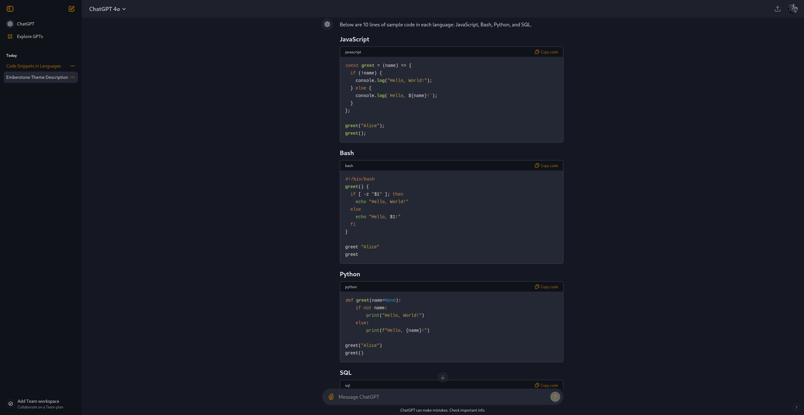

<h1 align="center">
	
     
	Emberstone for Stylus
</h1>

A vibrant, dark theme with warm accents to boost focus. Designed for those seeking a solid, lively environment that’s easy on the eyes.

## Requirement

This repo, provides CSS styles for [Stylus](https://github.com/openstyles/stylus) browser extension :
- [Firefox extension](https://addons.mozilla.org/fr/firefox/addon/styl-us/)
- [Chromium extension](https://chromewebstore.google.com/detail/stylus/clngdbkpkpeebahjckkjfobafhncgmne?hl=fr&pli=1)

## Installation

You'll find themes and previews on the `./styles` folder. Each website have its css and preview associated.

## 🎨 Color Palette

### Online Reference

You can access the always up-to-date Figma version here: [Figma Palette](https://www.figma.com/design/MVqAtxFct344uUigFxsbya/Emberstonbe-Theme-research?node-id=0-1&t=Ud7ZHjzNFhPdlMNp-1) and the [palette repo](https://github.com/Emberstone-theme/palette).

## 💻 Previews

  
Chat GPT

	

	
	

## 💬 Contributing

We welcome contributions! Whether it's reporting a bug, requesting a new feature, or directly improving the themes, your input helps shape Emberstone.

## 📢 Feedback & Support

Found a bug? Have a feature request? Head over to the project's issue page to let us know. Your feedback is invaluable.

## 📜 License

Emberstone is open-source and available under the MIT License.
